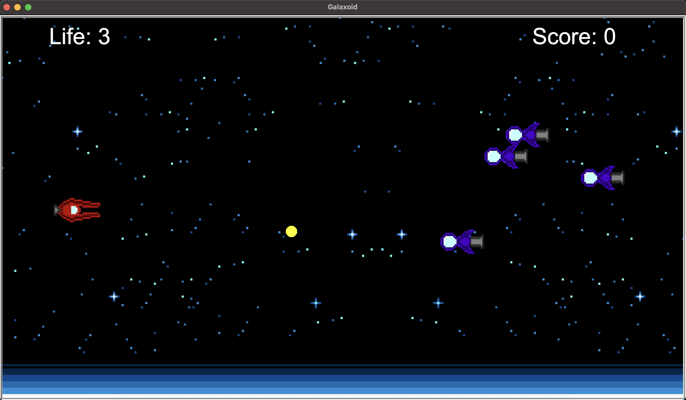

# Galaxoid #
This Program is a project for Computer Programming 1 Course.
It is inspired by Star Wars, and G-Darius.

### Overview and Features ###
This Game is an ***Endless Space Shooter Game***. It is account-based system, which
you can sign up or log in to play and store your high score.

### How to use and play? ###
1. Sign Up or Log in with username and password.
2. Confirm to play the game.
3. The game starts.
   * Press Arrow Keys to Move.
   * Press Space Bar Key to Shoot Laser.
   * Press ESC Key to Quit and Close the game.
4. The game ends.
5. Round Summary will be showed up with Score, Accuracy, and Current Rank.
6. The Current **Top 5** Leaderboard will be showed up.

### Program's Requirement ###
There are **5** Python Modules & Libraries required in this program.
* [turtle](https://docs.python.org/3/library/turtle.html): Used for Gameplay and Graphic
* [json](https://docs.python.org/3/library/json.html?highlight=json#module-json): Used for Storing User's Data
* [time](https://docs.python.org/3.11/library/time.html): Used for Story Display 
* [random](https://docs.python.org/3/library/random.html): Used for Gameplay
* [sys](https://docs.python.org/3/library/sys.html): Used for Check System OS

### Program Design ###
There are **7** classes in this Program.
* **Account**: This class is used for managing Users' Data. It reads and writes users' data in json file.
* **PlayerShip**: This class is used for managing Player Sprite with turtle. It contains player's name, score, life, etc. as attributes.
* **EnemyShip**: This class is used for managing Enemy Sprite with turtle. It contains enemy's point as attribute.
* **BossShip**: This class is used for managing Boss Sprite with turtle. It contains boss's health, point as attributes.
* **Laser**: This class is used for control Laser Sprite with turtle. It can check collision with ships.
* **Buff**: This class is used for create Buff Sprite with turtle. As it collides with PlayerShip, it will add life/score to PlayerShip.
* **Game**: This class is used for controlling the main game by integrating PlayerShip, EnemyShip, BossShip, Laser, and Buff classes together.

### Code Structure ###
* [main_game.py](main_game.py): Run Main Program.
* [game.py](game.py): Contains Game Class.
* [ship.py](ship.py): Contains PlayerShip, EnemyClass, and BossShip Classes.
* [item.py](item.py): Contains Laser, and Buff Classes.
* [account.py](account.py): Contains Account Class.
* [accounts.json](accounts.json): Contains Users' Data (Name, Password(hashed), and High Score).